---
cssclasses:
  - force-rtl
course: הנדסת תוכנה (63301)
type: סיכום למבחן
sources: כל הקורס 2026 ‏·‏ סיכום עומר לוי קיץ 25 ‏·‏ 372 שאלות ממבחני 2019–2025
---

# הנדסת תוכנה – סיכום למבחן

> [!info] איך הסיכום בנוי
> הסדר הוא **לפי משקל במבחן**, לא לפי סדר ההרצאות.‏ כל פרק נגמר ב־**"שאלות שחוזרות"**: שאלות שהופיעו כמעט מילה במילה במבחנים (תשובה מתוך טופס 0 או מחוון רשמי).
> 🆕 = הרצאה שלא ראית (6 ואילך).‏ ⚠️ = מלכודת שחוזרת.
> המבחן: אמריקאי בלבד, ~20 שאלות, בלי כתיבת קוד.‏ הרבה שאלות חוזרות בין מועדים כמעט מילה במילה, ולכן תרגול מבחני עבר הוא חצי מהעבודה.

## משקל הנושאים (לפי מבחני 2024–2025, 172 שאלות)

| נושא | שאלות | הרצאה | ראית? |
|---|---|---|---|
| UML (Sequence, Class, Use Case, State) | 42 | 6–7 | 🆕 |
| תבניות עיצוב + MVC | 38 | 8–10 | 🆕 |
| Agile / Scrum | 24 | 5 | ✅ |
| בדיקות (Unit, Mock, TDD, JUnit) | 24 | 11 | 🆕 |
| מבוא + מודלי פיתוח (Waterfall, V, Build&Fix) | 21 | 1–2, 5 | ✅ |
| ארכיטקטורה (Layers, Pipe&Filter, Views, Reuse) | 10 | 6–8 | 🆕 |
| CI/CD + קונפיגורציה | 5 | 1, אחרונה | 🆕 |
| דרישות | 3 | 4 | ✅ |

**המסקנה:** כ־70% מהמבחן יושב על חומר שלא ראית.‏ החדשות הטובות הן שזה החומר הכי "טכני" ועם הכי הרבה שאלות חוזרות.

---

## 1.‏ תבניות עיצוב (Design Patterns) 🆕

> [!abstract] 5 דקות לפני התרגול
> - **זיהוי תבנית:** מתעדכנים אוטומטית = Observer ‏·‏ מופע יחיד = Singleton ‏·‏ הסוג ידוע רק בזמן ריצה = Factory ‏·‏ הפרדת יוזם ממבצע, Undo, הקלטה = Command ‏·‏ ממשקים לא תואמים = Adapter.
> - **Observer:** ה־Subject עושה `Attach`, `Detach`, `Notify`.‏ סינון עדכונים ב־`notify`, עדיפות ב־`Attach`.‏ חץ ירושה בין abstract ל־concrete.‏ הקשר הוא הכלה.
> - **Singleton:** מחלקה אחת, בנאי `private`.‏ "לא יוצא מופע יחיד" אומר שהבנאי לא פרטי.
> - **Factory:** הלקוח בוחר סוג בזמן ריצה עם פרמטר.‏ מתודה שמחזירה interface.‏ היתרון: ניתוק מהמחלקה הקונקרטית.
> - **Command:** מקליט, כפתור או תפריט = Invoker ‏·‏ הפעולה = Command ‏·‏ עורך או מסמך = Receiver.‏ ה־Invoker מכיל את ה־Command.

^prep-1

**Design Pattern** = פתרון כללי שאפשר להשתמש בו שוב לבעיה נפוצה בעיצוב.‏ זה לא קוד מוכן.
לכל תבנית 4 מרכיבים: **שם ‏·‏ תיאור הבעיה ‏·‏ תיאור הפתרון (UML) ‏·‏ תוצאות והשלכות**.

### זיהוי מהיר לפי ניסוח השאלה

| אם בשאלה כתוב… | התשובה |
|---|---|
| "כשאחד משתנה, כולם צריכים להתעדכן אוטומטית", התראות, מחירי מניות | **Observer** |
| "מופע יחיד", גישה גלובלית, חיבור יחיד ל־DB, תור הדפסה יחיד | **Singleton** |
| "הסוג המדויק לא ידוע עד זמן הריצה", `JSONParser`/`XMLParser`/`CSVParser` | **Factory Method** |
| "להפריד בין מי שמבקש פעולה למי שמבצע", Undo/Redo, הקלטת פעולות, תור פקודות | **Command** |
| "שתי מחלקות עם ממשקים לא תואמים", "לעטוף מחלקה ישנה" | **Adapter** |

### Observer (צופה)

- **Subject** ‏·‏ מחזיק את המידע ואת **רשימת הצופים**.‏ יש לו `Attach()` (הוספת צופה), `Detach()` (הסרת צופה), `Notify()` (עדכון כולם).
- **Observer** ‏·‏ ממשק עם `Update()`.‏ כל מי שרוצה להאזין מממש אותו.
- ה־Subject **לא מכיר** את הצופים הספציפיים, ולכן אפשר להוסיף סוג צופה חדש בלי לשנות את ה־Subject.
- **בתרשים המחלקות:** שתי רמות, **abstract ו־concrete**.‏ חץ הירושה הוא **בין המחלקה המופשטת למחלקה המוחשית**.
- קשר Subject–Observer = **הכלה** (ה־Subject מחזיק רשימה של Observers).

⚠️ **מלכודות Observer:**
- **מי מוסיף את מי?** ה־**Subject** מוסיף את ה־Observer (`Attach` נקרא על ה־Subject).
- **רק חלק מהצופים יקבלו חלק מהנתונים?** הסינון נעשה **בפעולת ה־`notify`** של ה־Subject.
- **עדכון לפי עדיפות?** ב־**`Attach`** ה־Subject מכניס את ה־Observer **לתור לפי עדיפות**.
- **Observer אחד רשום לשני Subjects?** קוראים ל־`Attach` **בכל Subject** בנפרד.
- **Attach** = לחבר Observer ל־Subject.‏ **Detach** = לנתק Observer מה־Subject.

### Singleton (יחיד)

- מחלקה **אחת** בתרשים (אם "אחד" לא מופיע באפשרויות, התשובה היא "כל התשובות האחרות שגויות").
- **בנאי פרטי** (`private`) + מתודה סטטית `getInstance()` שמחזירה את המופע היחיד.
- ⚠️ "הקוד לא מייצר מופע יחיד, למה?" התשובה: **הבנאי לא פרטי**.
- ⚠️ "מחלקה שאפשר ליצור ממנה **שני** מופעים בלבד, כל אחד גלובלי": עדיין **Singleton**, ואוכפים את הכמות **בפונקציית אחזור האובייקט**.
- דוגמה מהמבחן: **תור יחיד למספר מדפסות**.

### Factory Method (מפעל)

- **הבעיה:** `new Dog()` יוצר תלות קשיחה במחלקה קונקרטית.
- **הפתרון:** מבקשים מה"מפעל" ליצור את האובייקט.
- 4 תפקידים:
  - **Product** ‏·‏ ממשק או מחלקה מופשטת של המוצר.
  - **ConcreteProduct** ‏·‏ המוצר הספציפי.
  - **Creator** ‏·‏ מגדיר את `FactoryMethod()` בלי לממש אותה.
  - **ConcreteCreator** ‏·‏ מממש ומחזיר `new ConcreteProduct()`.
- **איך בוחרים את הסוג?** **הלקוח קובע בזמן ריצה באמצעות פרמטר.**
- **איך זה עובד טכנית?** מתודה אחת **שמחזירה interface** (או מקבלת פרמטר שמייצג את האובייקט הרצוי), וממנה יורשות המחלקות הקונקרטיות.
- **היתרון:** **ניתוק הלקוח מהמחלקה הקונקרטית**, כלומר הפרדה בין הקוד שיוצר אובייקטים לקוד שמשתמש בהם.
- **מתי Factory ולא `new`?** כשסוג האובייקט **לא ידוע עד זמן הריצה**.

### Command (פקודה)

- כל פעולה נארזת **כאובייקט** עם `execute()`.‏ זה מנתק את מי שיוזם מהמבצע.
- תפקידים:
  - **Command** ‏·‏ ממשק עם `Execute()`.
  - **ConcreteCommand** ‏·‏ פקודה ספציפית שמחזיקה רפרנס ל־Receiver.
  - **Receiver** ‏·‏ **המבצע בפועל**, שעליו הפעולה מתבצעת (למשל המסמך).
  - **Invoker** ‏·‏ **היוזם**, מחזיק את הפקודה וקורא ל־`Execute()` (כפתור, תפריט, שלט).
  - **Client** ‏·‏ יוצר את הפקודה ומשדך לה Receiver.
- קשר Command–Invoker = **הכלה**.
- שימושים: **Undo/Redo**, תור ותזמון פקודות, אותה פקודה מכמה מקומות (תפריט + קליק ימני).

⚠️ **השאלה שחזרה ב־3 מבחנים ב־2025 (מקליט משתמש לעורך טקסט):**
**מקליט = Invoker ‏·‏ פעולת "הוספת טקסט" = Command ‏·‏ עורך טקסט = Receiver**
ובגרסה הישנה: **כפתורים ותפריטים = Invoker ‏·‏ המסמך = Receiver**.

### Adapter (מתאם)

ממיר ממשק של מחלקה אחת לממשק שמחלקה אחרת מצפה לו.‏ כל "לגרום למחלקה ישנה לעבוד עם ממשק חדש" מוביל ל־**Adapter**.

### תבניות שמופיעות רק במבחני "אקסמן" (דוגמה)

- **Singleton ו־Flyweight** ‏·‏ משותף: **בנאי שפועל רק אם עצמים מסוימים טרם נבנו**.
- **Mediator ו־Observer** ‏·‏ משותף: **תרשים מחלקות דומה מאוד**.
- **Chain of Responsibility** ‏·‏ **המטפל הראשון שיכול לטפל מבצע**.
- **Abstract Factory** ‏·‏ דוגמה: **מערכת חלונות במערכות הפעלה שונות**.

### מהמבחנים הישנים (2019 ומבחני דוגמה)

- **Command** עושה שימוש בעקרון **Loosely decoupled**.
- **Singleton** שימושי כאשר **האובייקט שולט במשאב מצומצם** במערכת.‏ "על איזה צורך עונה?" **שימוש במופע יחיד**.
- **Design Patterns** משמשות **לשימור והעברת ידע על תיכון אופטימלי**.
- **MVC** שימושי בעיקר ל**מערכות עם ממשק משתמש מורכב**.‏ זרימת המידע היא דו־כיוונית: View ל־Controller ל־Model, וחזרה מ־Model דרך Controller ל־View.
- **Adapter:** משחק עם כלי רכב על כביש ואובייקטי תעופה בחלל שצריך לשלב ביניהם, כלומר ממשקים לא תואמים.
- **Factory Method** "יוצרת את המופע הרלוונטי בהתאם לבקשת המשתמש".

---

## 2.‏ UML – תרשימים 🆕

> [!abstract] 5 דקות לפני התרגול
> - **סיווג:** Use Case ו־Sequence = interaction ‏·‏ Class = structure ‏·‏ Activity = context ‏·‏ State = behavioral.‏ אם הנכון לא מופיע, התשובה היא "כל התשובות האחרות שגויות".
> - **Sequence:** קוראים מלמעלה למטה.‏ Lifeline = משתתף + חלוף זמן.‏ Activation bar = מבצע ומחכה לתשובה.‏ X = הריסה.‏ אין קשרים, רק הודעות.‏ מספר תרשימים = מספר האירועים.
> - **Class:** מגדיר היררכיה ותכונות (לא סדר זמנים ולא מחשבים פיזיים).‏ משולש = ירושה, מעוין מלא = composition, מעוין ריק = aggregation.‏ `1..*` = רשימה, `1..10` = מערך.
> - **Use Case:** include = חובה, extend = אופציונלי.‏ **אין ציר זמן.** הרבה use cases מפוצלים לכמה תרשימים.‏ Include/Extend לא שייכים ל־Class.
> - **Statechart:** XOR = רק אחד בכל רגע, AND = במקביל.

^prep-2

### ⭐ סיווג התרשימים למודלים (Sommerville) – נשאל בכל מבחן

| מודל | מה הוא מתאר | תרשימים |
|---|---|---|
| **Context model** | המערכת מול הסביבה, מה בפנים ומה בחוץ | Context diagram, **Activity diagram** (תהליך עסקי) |
| **Interaction model** | תקשורת: משתמש מול מערכת, רכיבים ביניהם | **Use Case**, **Sequence** |
| **Structural model** | מבנה סטטי | **Class**, Deployment |
| **Behavioral model** | תגובה לאירועים, מצבים | **State Machine (Statechart)**, Activity (זרימת נתונים) |

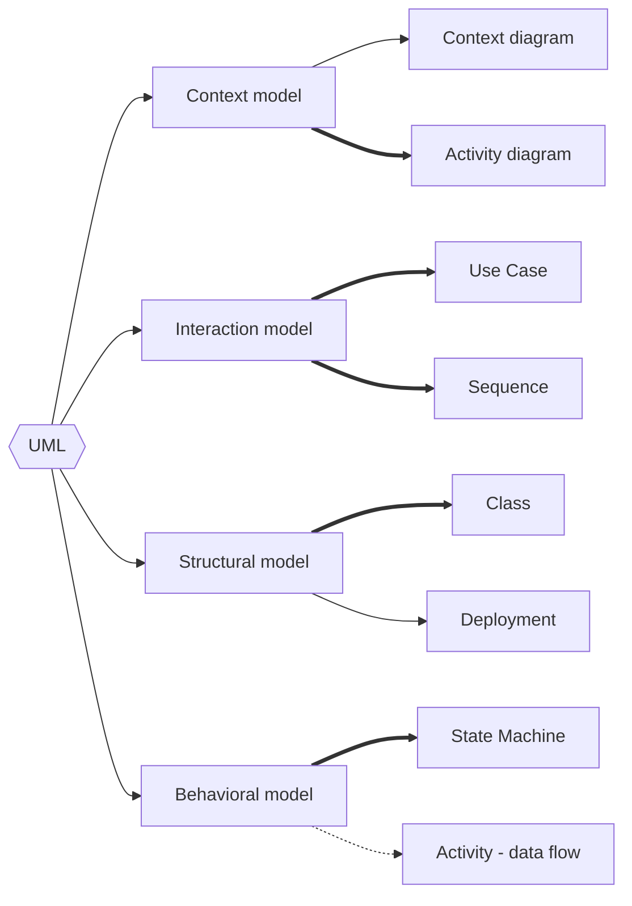

חץ עבה = התשובה שהמחוון מקבל.‏ Activity מופיע פעמיים, אבל במבחן התשובה היא **context**.

⚠️ **מלכודות סיווג:**
- **Use Case** שייך ל־**interaction model**.‏ אם הוא לא באפשרויות, התשובה היא "**כל התשובות האחרות שגויות**".‏ (סיכום עומר כותב Behavioural, וזה **לא** מה שהמחוון מקבל.)
- **Activity** שייך ל־**context model** (תשובה רשמית 2025).
- **Sequence** שייך ל־**interaction**.‏ אם באפשרויות יש רק context/structure/AI/MVC, התשובה היא "כל התשובות האחרות שגויות".
- **Class** שייך ל־**structure**.
- "דוגמאות לתרשימי התנהגות": כל זוג שכולל **Class** או **Object** שגוי, כי אלה תרשימי מבנה.
- **UML עצמו** לא שייך למודל אחד.‏ זו שפה שכוללת את כולם.

### Sequence Diagram (תרשים רצף)

- מתאר **איך אובייקטים משתפים פעולה לאורך זמן** בתרחיש אחד.
- **קוראים מלמעלה למטה**.‏ הציר האנכי הוא **זמן**, והציר האופקי הוא **המשתתפים**.
- מכיל: **עצמים, ציר זמן, מסרים**.
- רכיבים:
  - **Actor** (איש קטן) ‏·‏ ישות **חיצונית** שיוזמת.
  - **Participant** (מלבן) ‏·‏ אובייקט או רכיב **בתוך** המערכת.
  - **Lifeline** (קו מקווקו אנכי) ‏·‏ ⚠️ **"משתתף בודד באינטראקציה, והקו האנכי מציין חלוף זמן"**.‏ זה **לא** "רצף אירועים".
  - **Activation Bar** (מלבן צר על הקו) ‏·‏ **הזמן שבו המשתתף מבצע פעולה ומחכה לתשובה**.
  - **X** בסוף הקו ‏·‏ **הריסה (destruction) של עצם זמני**.
  - **חץ מלא** ‏·‏ הודעה סינכרונית.‏ **חץ מקווקו** ‏·‏ תשובה (Return).
- **בין היישויות אין "קשרים"** (בניגוד ל־Class).‏ יש רק **הודעות**.
- **מספר תרשימי Sequence במערכת = מספר האירועים האפשריים** (תרחיש אחד לכל תרשים).
- ⚠️ שאלת "מה חסר בדיאגרמה": user שולח ל־Server, ו־Server שולח ל־DB.‏ חסרים **חיצי תשובה**, **קודם מה־DB לשרת ואז מהשרת למשתמש**.

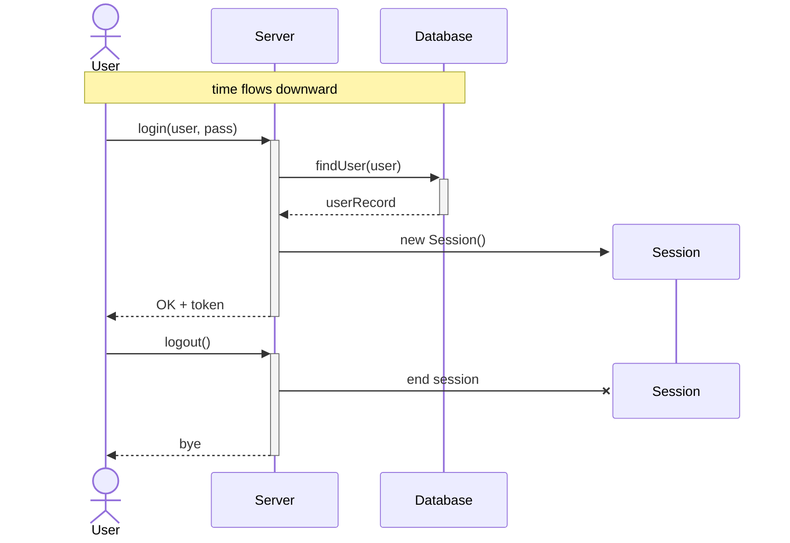

**מה לראות כאן:** User הוא Actor (חיצוני), השאר participants.‏ המלבנים הצרים על הקווים הם activation bars: Server פעיל מהבקשה ועד שהוא מחזיר תשובה.‏ חיצי התשובה מקווקווים וחוזרים **בסדר הפוך**: DB אל Server, ואז Server אל User.‏ Session נוצר באמצע התרחיש ונהרס בסופו (ה־X).

**שאלות "אילו יישויות יופיעו" (מבוססות על תיאור מערכת):**
- משחק שרת־לקוח: **שרת, ממשק גרפי, ושחקן (actor)**.
- מוקד AI: **מרכזיה כ־Actor, שרת כ־participant, שירות ענן LLM כ־participant**.
- קטלוג מוצרים, עדכון מוצרים ע"י מנהל: **מנהל המערכת, מסד הנתונים, ה־GUI (רכיב 4) ושירות המוצרים (רכיב 1)**.
- קטלוג, תהליך Batch: **תהליך ה־Batch, המתזמן, ומסד הנתונים** (אין שם משתמש אנושי).

### Class Diagram (תרשים מחלקות)

- **תרשים מבנה**, סטטי.‏ משמש ל**בניית תיכון (design) איכותי**, בשלב **design & development**.
- מלבן = מחלקה: **שם** למעלה, **שדות** באמצע, **מתודות** למטה.
- **"יכול לסייע":** ⚠️ **להגדיר יחס היררכי של מחלקות ואובייקטים ולהגדיר תכונות של מחלקות**.
  - "סדר זמנים של קריאות" הוא Sequence, ולכן שגוי.
  - "פיצול לפי מחשבים פיזיים" הוא Deployment, ולכן שגוי.
  - "חישובי זמני ריצה" שגוי.
- באופן אידיאלי **בלתי תלוי בשפת תכנות**.

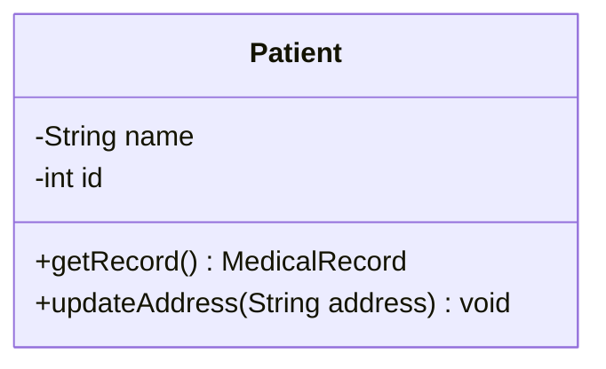

**מבנה המלבן:** שם למעלה, שדות באמצע, מתודות למטה.‏ `-` = private, `+` = public.

**קשרים בין מחלקות:**

| קשר | סימון | משמעות |
|---|---|---|
| **Association** | קו פשוט (אפשר עם תווית וריבוי) | יש ביניהן אינטראקציה |
| **Generalization / Inheritance** | **חץ עם ראש משולש ריק**, מצביע אל האבא | ירושה |
| **Composition** | **מעוין מלא** בצד המכיל | "חלק מ־" חזק: מוחקים את השלם והחלקים נמחקים |
| **Aggregation** | **מעוין ריק** בצד המכיל | "מכיל" חלש: החלקים חיים גם בלי השלם |

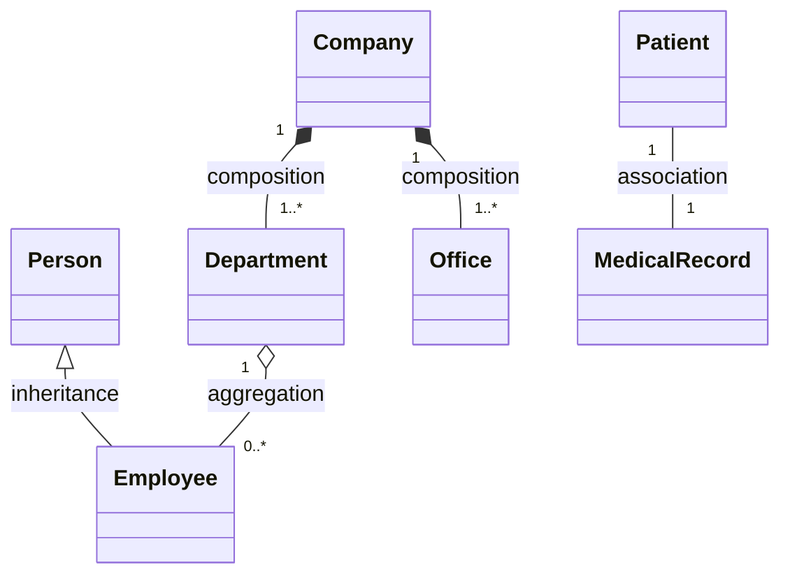

**איך לקרוא:** המשולש נוגע ב**אבא** (Person).‏ המעוין תמיד בצד ה**שלם** (Company, Department).‏ Company נמחקת, אז גם Department ו־Office נמחקים (מעוין מלא).‏ Department נסגרת, אבל העובדים נשארים (מעוין ריק).

⚠️ **Include / Extend הם קשרים של Use Case, לא של Class.** בשאלה "אילו קשרים בין מחלקות" עם אפשרויות Include/Extend/Exclude, התשובה היא "**כל התשובות האחרות שגויות**".

**ריבוי (Multiplicity) ואיך מממשים בקוד:**
- `1` ‏·‏ אחד לאחד (מטופל ‏↔‏ רשומה רפואית).
- `1..*` ‏·‏ אחד לרבים, מימוש ב**רשימה** (מבנה נתונים דינמי).
- `1..10` ‏·‏ כמות חסומה, מימוש ב**מערך**.
- composition עם `1..*` (Company מכילה Department ו־Office): **מוכלות במבני נתונים דינמיים במחלקה Company**.

איך התרשים הזה נראה בקוד (השדות יושבים במחלקה עם המעוין):

```java
class Company {
    private List<Department> departments = new ArrayList<>(); // 1..*  -> List (dynamic)
    private Office[] offices = new Office[10];                  // 1..10 -> array (bounded)
}
```

**תרשימי מחלקות של תבניות (נשאל!):**

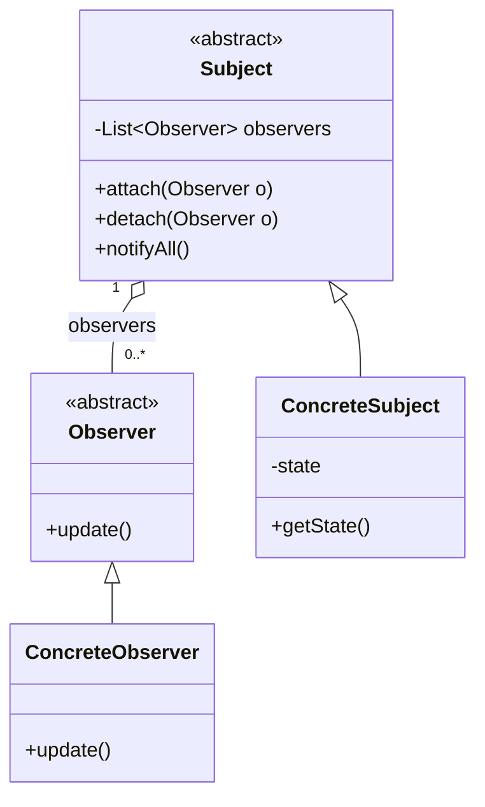

- **Observer:** שתי רמות, abstract למעלה ו־concrete למטה.‏ חץ הירושה הולך **ממחלקה מופשטת למחלקה מוחשית**, אף פעם לא בין שתי מופשטות או שתי מוחשיות.
- **Mediator** נראה כמעט אותו דבר (מרכז אחד שמחזיק רבים), ולכן "המשותף ל־Mediator ול־Observer" הוא **מבנה תרשים המחלקות**.

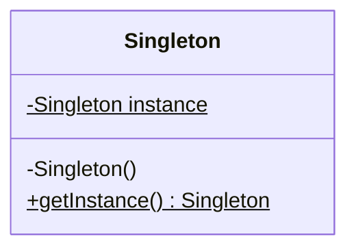

- **Singleton:** **מחלקה אחת בלבד**.‏ בנאי private, שדה סטטי (קו תחתון = static), ומתודה סטטית שמחזירה את המופע.‏ אם "אחד" לא באפשרויות, התשובה היא "כל התשובות האחרות שגויות".

### Use Case Diagram

- **High level**, מגדיר **מה** המערכת עושה (לא איך).‏ מגדיר **Scope**.
- **Actor** (איש) ‏·‏ כל ישות חיצונית: אדם, ארגון, או **מערכת אחרת**.
- **Use Case** (אליפסה) ‏·‏ פונקציה או שירות.
- **System Boundary** (מסגרת) ‏·‏ מפרידה בין פנים לחוץ.
- **`<<include>>`** ‏·‏ **חובה**.‏ אי אפשר להשלים את ה־use case הראשי בלעדיו.
- **`<<extend>>`** ‏·‏ **אופציונלי**, קורה רק בתנאים מסוימים.
- ⚠️ **ציר זמן: אין!** (שאלה חוזרת)
- ⚠️ הרבה use cases? **מפצלים לכמה תרשימים** לפי נושא.

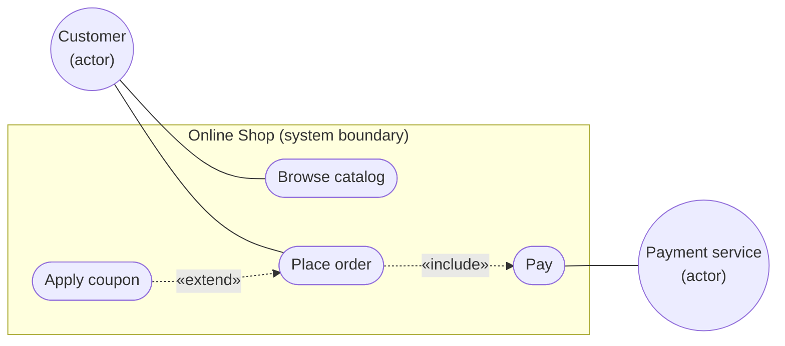

**כיוון החצים:** include יוצא **מהראשי אל החובה** (אי אפשר להזמין בלי לשלם).‏ extend יוצא **מהאופציונלי אל הראשי** (קופון רק לפעמים).‏ שירות התשלומים הוא מערכת אחרת, ולכן גם הוא actor.‏ ואין כאן שום סדר בזמן.

### Activity Diagram

- "תרשים זרימה משוכלל": רצף פעולות, החלטות, מקביליות.
- עיגול מלא = התחלה ‏·‏ מלבן מעוגל = פעילות ‏·‏ מעוין = החלטה ‏·‏ עיגול עם מסגרת = סוף.
- **קו שחור עבה (solid bar)** ‏·‏ פיצול או סנכרון.‏ ⚠️ אם כמה פעילויות נכנסות ל־bar, **כולן חייבות להסתיים לפני שממשיכים**.

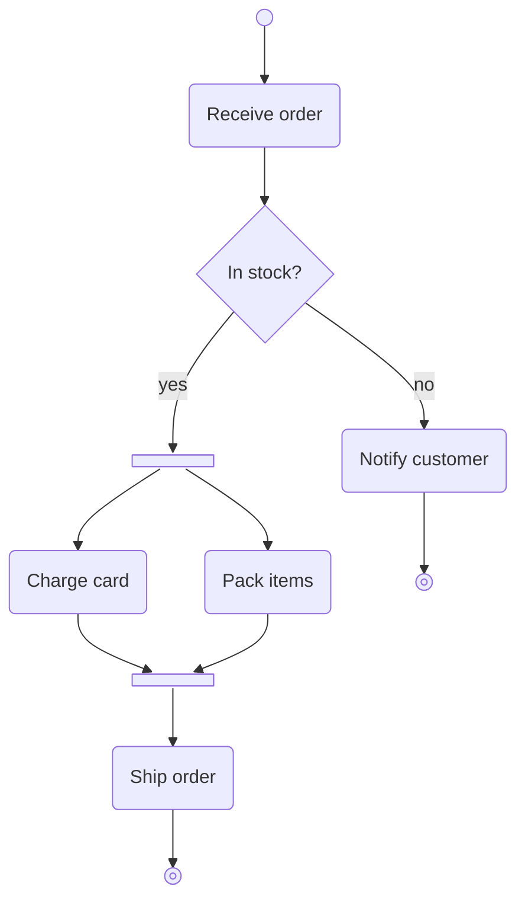

**מה לראות כאן:** הבר העליון מפצל לשתי פעילויות מקבילות.‏ הבר התחתון מסנכרן: Ship מתחיל רק אחרי ש**גם** Charge **וגם** Pack הסתיימו.

### State Machine / Statechart (תרשים מיצוב)

- מתאר **את כל המצבים האפשריים** של אובייקט או מערכת, ומעברים בעקבות אירועים.
- **לא כולל מסרים**, ו**לא מיועד לתאר תרחיש** (זה Sequence).
- ההבדל ממכונת מצבים רגילה: **מקבול**.
- **XOR** ‏·‏ תת־מצבים בתוך מצב גדול, **רק אחד קיים בזמן נתון**.
- **AND** ‏·‏ מצבים **בלתי תלויים שמתקיימים במקביל**.

**XOR** (הנגן נמצא בדיוק באחד מתת־המצבים של On):

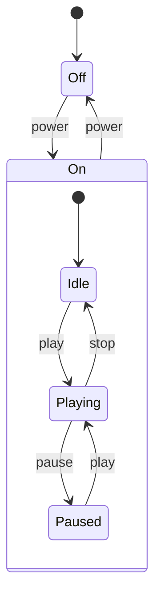

**AND** (שני אזורים מקווקווים בתוך Phone, ובכל רגע יש מצב אחד **בכל** אזור.‏ בספר מפרידים ביניהם בקו מקווקו):

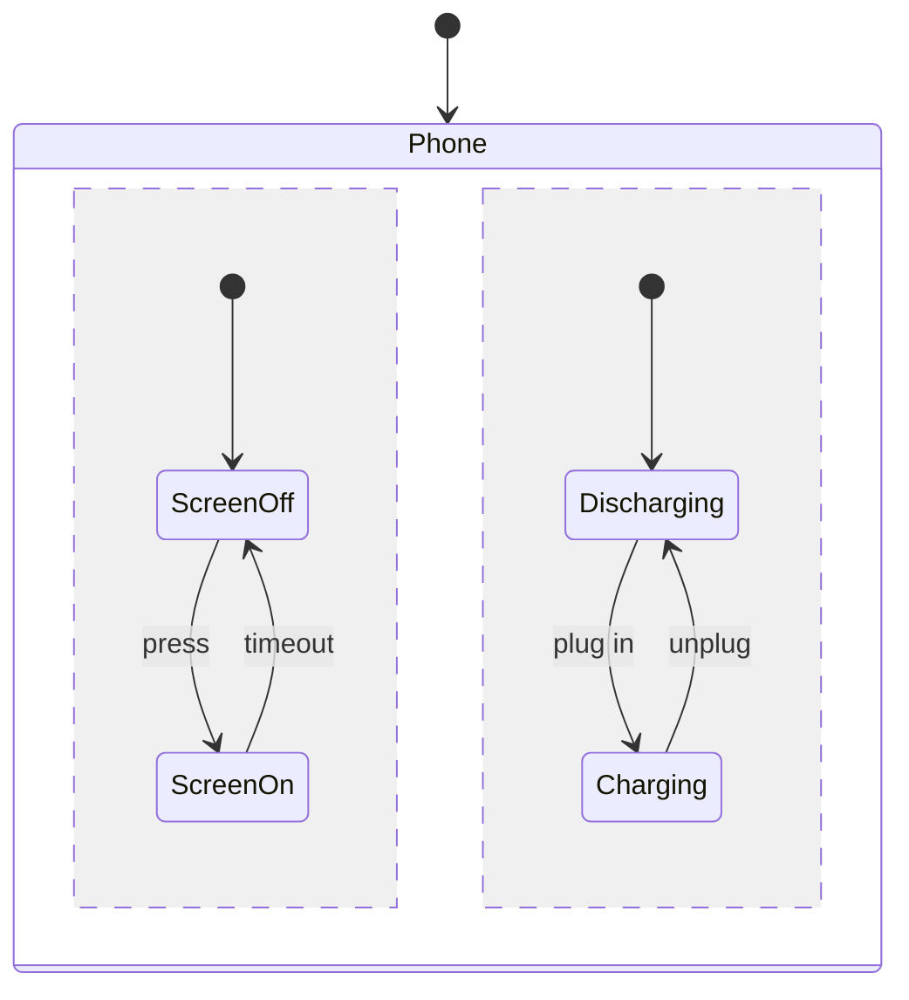

למשל ScreenOn וגם Charging באותו זמן.‏ שימו לב: אין כאן הודעות ואין תרחיש, רק מצבים ומעברים.

### Context Diagram

רק **המערכת במרכז + המערכות החיצוניות** שמתקשרות איתה, בלי פירוט פנימי.‏ מראה **קשרים**, לא **איך** המידע עובר.‏ נועד לשיחה עם אנשים לא טכניים.

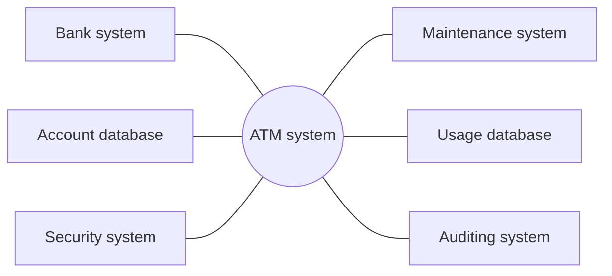

(הדוגמה של Sommerville.) קווים פשוטים בלי חצים ובלי הודעות: רק **מי מחובר למי**.

### מהמבחנים הישנים (2019 ומבחני דוגמה)

- **Sequence** שייך למשפחת **מודלי אינטראקציה**.
- **קווים מקווקווים** ב־Sequence: "**יש יותר מתשובה אחת נכונה**" (גם lifeline וגם הודעת תשובה).
- **סימון מוקף באדום** (activation bar): רק מי שעליו המלבן הצר **פעיל**.‏ קרא בדיוק על איזה קו הוא יושב.

---

## 3.‏ ארכיטקטורה 🆕

> [!abstract] 5 דקות לפני התרגול
> - **4 views:** לוגי, פיזי, פיתוחי, תהליכי.‏ Development = מבנה היחידות, ולפיו אילו התמחויות צריך בצוות.
> - **MVC:** Model = נתונים ולוגיקה, ה־Controller מעדכן את ה־Model, קל להחליף View.‏ מקרה פרטי של שכבות.‏ לא מתאים ל־Embedded.
> - **שכבות:** לכל שכבה אחריות משלה.‏ מחליפים שכבה? שומרים על אותו API.
> - **Client–Server:** כל שרת נותן שירות אחד.‏ לא מתאים ל־Stand-alone.‏ **Repository:** קשה להפיץ על כמה מכונות.
> - **Pipe & Filter:** אפשר לסדר מחדש בלי לשנות את המסננים.‏ אם אין שלבים מוגדרים, השימוש שגוי.
> - **מבוזר:** טוב ב־Scale Up, מתקשה ב־Deployment.‏ **Reuse:** "יש עלות, אבל יתרונות משמעותיים".‏ Abstract = patterns, Object = ספריות (java mail).

^prep-3

### ארבע נקודות מבט למידול (System Perspectives)

**Context** (מבחוץ, גבולות) ‏·‏ **Interaction** (תקשורת) ‏·‏ **Structure** (ארגון, מבנה) ‏·‏ **Behavioral** (תגובה לאירועים).

### Architectural Views (4+1) – שאלה חוזרת

⚠️ **ארבעת ההיבטים: לוגי, פיזי, פיתוחי, תהליכי** (Logical, Physical, Development, Process).‏ ה־"+1" הוא Scenario/Abstract.

| View | מה הוא מתאר |
|---|---|
| **Logical** | הדרישות הפונקציונליות, מחלקות ואובייקטים (Class diagram) |
| **Physical** | חומרה, שרתים, רשתות ופריסה |
| **Development** | ⚠️ **מבנה היחידות והמודולים, ולפיו אילו התמחויות (Skills) נדרשות לצוותים** |
| **Process** | זמן ריצה: ביצועים, זמינות, סנכרון, צווארי בקבוק |
| **Scenario / Abstract** | Use Cases מרכזיים, ומה אפשר לעשות לו **Reuse** |

⚠️ "תכנון שיטת הפיתוח (אג'ייל) ב־development view" שגוי.‏ "בחירת טכנולוגיות ב־process view" שגוי.

### תבניות ארכיטקטוניות

שונות מ־Design Patterns: הן קובעות **את החלוקה הכללית של המערכת**, לא פרטי קוד.

**MVC**
- **Model** ‏·‏ הנתונים **והלוגיקה העסקית**, מדבר עם ה־DB.
- **View** ‏·‏ תצוגה בלבד ("טיפשה").
- **Controller** ‏·‏ **מתווך**.‏ מקבל אירוע מהמשתמש, **מעדכן את ה־Model**, ובוחר View.
- ⚠️ התשובה הנכונה: "**ה־Model מנהל את הנתונים והלוגיקה העסקית, וה־Controller מעדכן את ה־Model**".
- ⚠️ "**ניתן בקלות להחליף את ה־View**, בזכות הפרדת השכבות".‏ נכון.
- ⚠️ בקטלוג המוצרים: **רכיב 4 (GUI) הוא ה־View**.
- ⚠️ **MVC הוא מקרה פרטי של ארכיטקטורת השכבות.**
- ⚠️ הכי פחות מתאים ל־MVC: **Embedded control systems**.
- מחירי מניות שמוצגים בכמה ממשקים: **MVC + Observer**, הצגים רשומים כ־observers וגם כ־views.

**Layered (שכבות)**
- 4 שכבות: **UI** ‏·‏ **UI Management + Auth** ‏·‏ **Core Business Logic** ‏·‏ **System Support** (OS, DB).
- **לכל שכבה אחריות ספציפית.** לא מדלגים על שכבות.‏ מדברים דרך **API**.
- ⚠️ **החלפת שכבה (למשל DB אחר בשכבה 4): לא משנים את השאר, רק חושפים את אותו API** ("יש לשמר את ה־API של שכבה 4").
- ⚠️ הוספת ממשק חדש: **מתחברים לשכבה 2 לפי ה־API הקיים**.
- חסרונות: ביצועים (מעבר בין הרבה שכבות), אין גישה ישירה.

**Client–Server**
- שרתים נותנים שירותים, ולקוחות ניגשים דרך רשת (Request/Response).
- ⚠️ **אופטימלי: כל שרת מעניק שירות אחד.**
- ⚠️ **לא יעשה שימוש ב־Client–Server: Stand-alone applications.**

**Pipe and Filter**
- כל Filter מקבל קלט, מעבד ומוציא פלט לצינור הבא.‏ כל Filter הוא **קופסה שחורה עצמאית**.
- ⚠️ **יתרון: ניתן בקלות לסדר מחדש וליצור רצפי עיבוד חדשים בלי לשנות את המסננים.** (התשובה השגויה אומרת שהשלבים תלויים זה בזה.)
- ⚠️ מתי מתאים: **תהליך שאפשר לפרק לשלבים עצמאיים**.‏ אם בתיאור **אין תהליך עם שלבים מוגדרים**, השימוש בתבנית **שגוי**.
- חסרונות: לא מתאים לאינטראקציה רבה עם המשתמש, Latency, צוואר בקבוק.

**Repository**
- כל הרכיבים עובדים מול **מאגר נתונים משותף אחד** (למשל קומפיילר).
- ⚠️ **חיסרון עיקרי: קשה להפצה על גבי מספר מכונות.**

**Transaction Processing** ‏·‏ פעולה **אטומית**: הכל או כלום (כספומט).‏ Web Server, Application Server, DB.

**Language Processing** ‏·‏ מתרגם שפה לייצוג אחר.‏ ⚠️ דוגמה: **מהדרים (compilers)**.

### מערכת מבוזרת (כל מודול בשרת נפרד)

- ⚠️ במה היא **מתמודדת הכי טוב?** **Scale Up** (מדרגיות).
- ⚠️ עם מה היא **תתקשה?** **Deployment**.
- **קרא טוב** אם השאלה היא "מתמודדת" או "תתקשה".‏ אותה שאלה הופיעה בשני הכיוונים.

### Reuse (שימוש חוזר)

- ⚠️ תשובה קבועה: "**חסרון העלות ידוע, ועדיין ישנם יתרונות משמעותיים נוספים**".
- מה ייתכן שיידרש? **ללמוד את השימוש במוצר.**
- **4 רמות:**
  - **Abstraction level** ‏·‏ ⚠️ ידע משותף: **design pattern / architectural pattern**.
  - **Object level** ‏·‏ ⚠️ **ספריות קוד כמו java mail**.‏ לא `String`!
  - **Component level** ‏·‏ רכיבים או תתי־מערכות שלמים.
  - **System level** ‏·‏ מערכת שלמה.
- יתרונות: זמן, עלות, איכות (כבר נבדק), Time to market.
- חסרונות: אינטגרציה, תלות חיצונית, חוסר התאמה, אבטחה.

### מהמבחנים הישנים (2019 ומבחני דוגמה)

- **Repository** מתאים בעיקר **למערכות שבהן נדרש שיתוף משאבים ופיתוח במקביל של שירותים שונים**.
- "סעיף שכולל **אך ורק** היבטים ארכיטקטוניים": **לוגי, פיזי ותהליכי** (כל אפשרות עם פריט זר נפסלת).
- **יתרון השכבות:** כל שכבה עומדת בפני עצמה, וזה מסייע בפיתוח, בבדיקות ובשינויים.

---

## 4.‏ Agile, Scrum ומודלי פיתוח ✅

> [!abstract] 5 דקות לפני התרגול
> - **בחירת מודל:** Waterfall = מפרט קבוע וקל לניהול ‏·‏ V = בדיקה לכל שלב (דרישות מול Acceptance, Unit ראשון) ‏·‏ Agile = שינויים ‏·‏ Build & Fix = POC (אבל **לא** "ניהול קל").
> - **Agile מול Build & Fix:** חלקי מוצר מול כל המוצר.
> - **מניפסט בפועל:** אנשים ואינטראקציות = צוותים מעורבים ‏·‏ תוכנה עובדת / תגובה לשינוי = זמני פיתוח קצרים ו־DEMOS ‏·‏ שיתוף לקוח = כל התשובות נכונות.
> - **תפקידים:** PO = חזון ו־Backlog.‏ SM = מנהל את התהליך בלבד (אם מציעים לו משהו אחר, כולן שגויות).‏ צוות של 5–10.
> - **פגישות:** Daily = 15 דק' בעמידה.‏ Review = מה הושלם ועדכון Backlog.‏ Retro = מה לשפר בתהליך.‏ סוגי פגישות = יומית ודו־שבועית.
> - **ארטיפקטים:** Sprint Backlog = מתכוונים לממש הכל.‏ Product Backlog = לא.‏ Burn-down = שעות שנותרו.‏ שערוך = Story Points.

^prep-4

### כללי אצבע לבחירת מודל

| אם בשאלה כתוב… | המודל |
|---|---|
| מפרט קבוע מראש, דרישות "קפואות", לו"ז ותקציב קבועים | **Waterfall** |
| מערכת קריטית (רפואה, תעופה), בדיקה לכל שלב | **V-Model** |
| שינויים תכופים, מעורבות לקוח גבוהה | **Agile / Scrum** |
| קטן, ניסיוני, POC, בלי תכנון | **Build & Fix** |

### Build and Fix

- כותבים קוד, מראים ללקוח, מתקנים עד שהוא מרוצה.
- יתרונות: **Time to Market**, סיפוק מיידי.‏ מתאים ל־**POC (הוכחת יכולת)** בשלב ראשון.
- ⚠️ **לא יתרון: "ניהול קל ופשוט"**, כי אי אפשר להעריך לו"ז ותקציב.
- ⚠️ **ההבדל מ־Agile:** באג'ייל **מציגים כל פעם חלקי מוצר**, ובבנה ותקן **מציגים את כל המוצר**.

### Waterfall

- לינארי: דרישות, תכנון, מימוש, בדיקות, פריסה, תחזוקה.‏ כל שלב נחתם לפני הבא.
- ⚠️ "**בפיתוח מבוסס מפל מים ניהול שלבי הפיתוח קל יותר**".‏ נכון.
- ⚠️ "**מתאים יותר למוצר עם מפרט קבוע מראש שלא צפוי להשתנות**".‏ נכון.
- ⚠️ מה יוביל לבחירה **שגויה** ב־Waterfall? **דרישות שעשויות להשתנות הרבה.**

### V-Model

- הרחבה של Waterfall: **לכל שלב תכנון יש שלב בדיקה מקביל**.

| שלב תכנון | שלב הבדיקה המקביל |
|---|---|
| ניתוח דרישות | **Acceptance** (בדיקת קבלת משתמשים) |
| עיצוב מערכת | System test |
| ארכיטקטורה | Integration test |
| עיצוב מודולים | **Unit test** |

- ⚠️ **הבדיקות מתוכננות בהתאם לשלב התקדמות הפרויקט, ומבוצעות אחרי הקידוד.**
- ⚠️ **בדיקות הקבלה מתוכננות בשלב הראשון ומבוצעות בשלב האחרון.**
- ⚠️ **איזו בדיקה מבוצעת ראשונה? Unit test.**
- ⚠️ ההבדל מ־Waterfall: **V מקשר במפורש כל שלב פיתוח לשלב בדיקה, ו־Waterfall מקבץ את כל הבדיקות לשלב אחד בסוף.**
- "בכל שלבי הפיתוח במודל V": **מבצעים ומתכננים בדיקות**.

### Agile Manifesto – ואיך כל סעיף מתבצע בפועל

| סעיף | בפועל (תשובת המבחן) |
|---|---|
| אנשים ואינטראקציות על פני תהליכים וכלים | ⚠️ **צוותי פיתוח מעורבים** |
| תוכנה עובדת על פני תיעוד מלא | ⚠️ **זמני פיתוח קצרים והצגות (DEMOS)** |
| שיתוף פעולה עם הלקוח על פני חוזים | ⚠️ **כל התשובות נכונות** |
| תגובה לשינוי על פני תוכנית קבועה | ⚠️ **זמני פיתוח קצרים והצגות (DEMOS)** |

- **מטרת Agile:** להסתגל לשינויים בדרישות ולספק **תוכנה עובדת בגרסאות**.
- **התקדמות העבודה:** **איטרציות קטנות וניתנות לניהול, עם לולאות משוב תכופות.**
- מאפיין אג'ייל שנשאל: **תכנון שלבי הבדיקה במקביל להתקדמות הפרויקט**.
- חסרונות: חוסר ודאות לגבי התוצר הסופי, תיעוד חסר, refactoring חוזר ("כל התשובות נכונות").

### Scrum

**Sprint** ‏·‏ Time-box קבוע (2–4 שבועות).‏ ⚠️ **המטרה: לספק תוספת מלאה למוצר שאפשר להציג.**

**תפקידים**
- ⚠️ **התפקידים העיקריים: Scrum Master ו־Product Owner** (ו־Team).
- **Team** ‏·‏ ⚠️ **5 עד 10 אנשים** (5–9 בסיכום).‏ אוטונומי ורב־תחומי, **מקצה לעצמו משימות**.
- **Product Owner** ‏·‏ ⚠️ **מגדיר את חזון המוצר ומנהל את ה־Backlog**.‏ נציג הלקוח, קובע עדיפויות.
- **Scrum Master** ‏·‏ ⚠️ **מנהל את תהליך ה־Scrum**.‏ "מאפשר", מסיר חסמים.‏ **לא** בוס הצוות, **לא** מקצה משימות, **לא** מגדיר חזון, **לא** אחראי על תקציב.‏ אם כל אלה מופיעים באפשרויות, התשובה היא "כל התשובות האחרות שגויות".

**פגישות**
- ⚠️ **סוגי הפגישות: יומית ודו־שבועית.**
- **Sprint Planning** ‏·‏ מתכננים את **יעדי הספרינט הבא**.
- **Daily Stand-up** ‏·‏ ⚠️ **15 דקות בעמידה כל בוקר** ("10 עד 20 דקות בתחילת היום").‏ שלוש שאלות: מה עשיתי אתמול, מה היום, מה חוסם אותי.‏ **לא פותרים בעיות בפגישה.**
- **Sprint Review** ‏·‏ ⚠️ **לדון בעבודה שהושלמה בספרינט ולעדכן את ה־Backlog**.‏ כולל Demo, שמטרתו **הצגת תוצרי הספרינט הנוכחי**.‏ מתמקד ב**מוצר**.
- **Retrospective** ‏·‏ ⚠️ **מה עבד טוב ומה אפשר לשפר בתהליך העבודה בספרינט הקודם**.‏ מתמקד ב**צוות**.‏ פנימי, Safe space.

**ארטיפקטים**
- **Product Backlog** ‏·‏ כל המשימות (PBI).‏ ⚠️ שאלת "הקשר בין Product Backlog לביצוע ספרינט": התשובה היא "**כל התשובות האחרות שגויות**", כי **לא** מממשים את כולו בספרינט אחד.
- **Sprint Backlog** ‏·‏ ⚠️ "**במהלך הספרינט יש כוונה לממש את כל הפריטים במלאי הספרינט**".‏ נכון.
- **Burn-Down Chart** ‏·‏ ⚠️ **גרף של סך השעות שעוד נותרו לביצוע בספרינט**.
- **שערוך עלויות** ‏·‏ ⚠️ **דיון על User Story Points**.
- **MVP** ‏·‏ הגרסה הבסיסית ביותר שאפשר לשחרר, כדי לקבל פידבק מוקדם.

### מהמבחנים הישנים (2019 ומבחני דוגמה)

- **Product Owner:** **קביעת עדיפויות סופיות למימוש מתוך מלאי המוצר**.
- **יתרון Agile על מפל מים:** **מתאים יותר לצרכי לקוח משתנים**.

---

## 5.‏ בדיקות (Testing) 🆕

> [!abstract] 5 דקות לפני התרגול
> - **רמות:** Unit = יחידת תוכנה קטנה.‏ Integration = שילוב יחידות שכבר נבדקו (= Sub-System).‏ אין הבטחה לאפס שגיאות.
> - **Inspection:** סטטי, ראשון בציר הזמן, לא אוטומטי ולא JUnit.‏ Code review = איכות קוד.‏ Design review = איכות ארכיטקטורה.
> - **Mock:** אובייקט מזויף שמבצע פקודת דמה שהוכנה מראש.‏ ה־Unit מכיל את ה־Mock, שהוא יחידה נוספת.
> - **JUnit:** setup (`@BeforeEach`) = הכנה או חיבור ‏·‏ `@Test` = הפעלה ‏·‏ tearDown = סגירה.‏ `assertEquals(expected, actual)`.‏ `assertTrue` בודק ערך בוליאני.
> - **TDD:** בדיקה לפני קוד, מתקדמים רק כשהבדיקות עוברות, 100% כיסוי.‏ Verification = מקרי קצה, Validation = צורך הלקוח.‏ ערכי גבול: 500 ו־1000.

^prep-5

### רמות

- **Unit Test** ‏·‏ ⚠️ **"בדיקה של יחידת תוכנה קטנה"** (פונקציה או מחלקה), בבידוד.‏ בדרך כלל ע"י המפתח.
- **Integration Test** ‏·‏ ⚠️ **שילוב תתי־מערכות / יחידות שכל אחת כבר נבדקה**.
  - ⚠️ נקראת גם **Sub-System Test**, כי **תת־מערכת בנויה מיותר מיחידה אחת**.
- **System Test** ‏·‏ המערכת כולה כיחידה אחת.
- **Acceptance Test** ‏·‏ מול דרישות הלקוח, לפני מסירה.
- **Release Test** ‏·‏ על גרסה שמיועדת להפצה.

### ⭐ "אין אף פעם הבטחה של אפס שגיאות"

- **משתדלים לכסות את כל השגיאות, אבל אין הבטחה מלאה.**
- "אפשר לגלות שגיאה אחרי Integration?" **כן**, כי אין הבטחה של אפס שגיאות.

### Inspection (בדיקות פיקוח, סטטיות)

- **בלי הרצה**: סקירה ידנית של מסמכים, תרשימים וקוד.
- סוגים:
  - **Design Review** ‏·‏ ⚠️ **בדיקת איכות הארכיטקטורה**.
  - **Code Review** ‏·‏ ⚠️ **בדיקת איכות הקוד**.‏ לא ביצועים, לא unit, לא אינטגרציה.‏ אם "איכות" לא מופיעה באפשרויות, התשובה היא "כל התשובות האחרות שגויות".
  - **UI Prototype Review**.
- ⚠️ **מה מבוצע ראשון בציר הזמן? Inspection Test.**
- ⚠️ **מה לא אוטומטי / JUnit לא מאפשר? Inspection Test.**

### Verification vs Validation

- **Validation** ‏·‏ "**האם בנינו את המערכת הנכונה?**" עונה לצרכי הלקוח (תרחישים רגילים, שימושיות).
- **Verification** ‏·‏ "**האם בנינו את המערכת נכון?**" לפי המפרט.‏ ⚠️ **בדיקה במקרי קצה, ואפילו בקלטים או תסריטים לא סבירים.**

### Mock

- ⚠️ **אובייקט מדומה שמחקה התנהגות של עצם אמיתי בדרכים מבוקרות.** המטרה: **להחליף אובייקט אמיתי באובייקט מזויף לצורך בדיקה**.
- ⚠️ **ה־Mock מבצע פקודת "דמה" שמכינים מראש.**
- ⚠️ **האובייקט שנבדק (Unit) מכיל את ה־Mock, שהוא יחידה נוספת** (לא פונקציה, וה־Mock לא מכיל את ה־Unit).
- אם כל האפשרויות הפוכות, התשובה היא "כל התשובות האחרות שגויות".

### JUnit ואנוטציות

- `@BeforeEach` (`setUp`) ‏·‏ רץ **לפני כל טסט**.
- `@AfterEach` (`tearDown`) ‏·‏ רץ **אחרי כל טסט**.
- `@BeforeAll` / `@AfterAll` ‏·‏ פעם אחת לפני או אחרי כולם.
- ⚠️ **תבנית השאלה:** יצירת או קריאת מידע, או חיבור לשרת, הולכים ל־**setup (`@BeforeEach`)**.‏ הפעלת הפונקציה הנבדקת הולכת ל־**`@Test`**.‏ סגירת קובץ או חיבור הולכת ל־**tearDown**.
- `assertEquals(expected, actual)` ‏·‏ ⚠️ **קודם ערך מצופה, אחר כך ערך אמיתי.**
- `assertTrue` ‏·‏ ⚠️ **בדיקת נכונות של משתנה בוליאני.**

### TDD

- **כותבים בדיקה לפני הקוד.** ⚠️ ההיגיון: **מתקדמים בפיתוח רק כשהבדיקות הקודמות הצליחו.**
- יתרון: ⚠️ **הקוד תמיד ב־100% כיסוי בדיקות.**
- באג'ייל: **מקביליות של פיתוח ובדיקות**.

### Test Cases – ערכי גבול

- ⚠️ `calculateDiscount` (הנחה של 10% מעל 1000, 5% בין 500 ל־1000): **בודקים ערכים קרובים לנקודות הגבול, 500 ו־1000.**

### רמת הבדיקות תלויה ב־

**Criticality** (כמה נזק באג יגרום) ‏·‏ **Customer Expectations** ‏·‏ **Market Environment** (מתחרים).

### מהמבחנים הישנים (2019 ומבחני דוגמה)

- **הקשר בין מפרט הדרישות לתוכנית הבדיקות:** **לפחות בדיקה אחת לכל דרישה**.
- **JUnit לא משמשת** לבדיקות **זמן ריצה ומקום**.
- `@Test` מריץ את המתודה **כ־Test Case**.
- **mockup** = בניית חלקי דמה בקוד כדי לבצע בדיקות יחידה טובות יותר.

---

## 6.‏ מבוא להנדסת תוכנה ✅

> [!abstract] 5 דקות לפני התרגול
> - **SE מול CS:** עקרונות הנדסיים (עיצוב, בדיקה, תחזוקה) מול תיאוריה ואלגוריתמים.‏ תחזוקה = כן תחום עיסוק.‏ מודלים מתמטיים ל־ML = לא.
> - **תכונה חסרה:** שינוי שובר חלקים אחרים = Maintainability.‏ בזבוז זיכרון = Efficiency.
> - **Generic ל־Customized:** בונים מוצר עם אפשרות להוסיף קוד.‏ **Customized ל־Generic:** קודם דרישות מלקוחות נוספים, ואז reuse.
> - **אפליקציות:** Stand-alone = בלי רשת ‏·‏ Transaction-based = פעולות קריטיות מול DB ‏·‏ Embedded = לא MVC ‏·‏ compilers = Language processing.
> - **שונות:** האינטרנט הפך את ההתקנה בשרת לזולה יותר.‏ Host–Target נפתר ב־Simulators.‏ רוב העלות היא בשינוי אחרי המסירה.

^prep-6

- **הנדסת תוכנה מול מדעי המחשב:** ⚠️ "**הנדסת תוכנה מיישמת עקרונות הנדסיים לפיתוח תוכנה, בדגש על עיצוב, בדיקה ותחזוקה.‏ מדעי המחשב מתמקדים בהיבטים התיאורטיים של חישוב ואלגוריתמים.**"
- **מהי הנדסת תוכנה:** **דיסציפלינה שעוסקת בכל שלבי הפיתוח, מהתיעוד הראשון ועד התחזוקה.** נועדה בעיקר ל**פיתוח תוכנה מקצועי**.
- **כן תחום עיסוק:** **תחזוקה של מערכות ייצוריות**.‏ **לא תחום עיסוק:** **פיתוח מודלים מתמטיים ללמידת מכונה**.
- **Professional vs non-professional:** ⚠️ **מלבד קוד המקור יש תוצרים נוספים** (תיעוד, קונפיגורציה).‏ "**תוכנה מקצועית מיועדת לצרכים עסקיים**".
- **עלויות:** רוב העלות היא ב**שינוי התוכנה אחרי שהיא אצל הלקוח** (כ־80% תחזוקה).
- **4 שלבי תהליך התוכנה:** Specification ‏·‏ Development ‏·‏ Validation ‏·‏ Evolution.
- **מתודולוגיה:** **מסגרת פורמלית שמכתיבה את השלבים, התפקידים והארטיפקטים.**

### תכונות תוכנה טובה – "איזו תכונה חסרה?"

| תכונה | אם בשאלה… |
|---|---|
| **Maintainability** | ⚠️ שינוי קטן במודול אחד גורם באגים בחלקים לא קשורים |
| **Efficiency** | ⚠️ בזבוז משאבים (זיכרון, CPU) |
| **Dependability & Security** | קריסות, פריצות |
| **Acceptability** | המשתמש לא מבין איך להפעיל |

### Generic vs Customized

- **Generic** ‏·‏ לשוק הרחב, החברה מחליטה (Office, Photoshop).
- **Customized** ‏·‏ ללקוח ספציפי, הלקוח מחליט (מערכות צה"ל, בנקים).
- ⚠️ **Generic ל־Customized:** "**החברות בונות את המוצר הגנרי עם אפשרות להוסיף קוד ע"י פיתוח עצמי**" (כמו SAP).
- ⚠️ **Customized ל־Generic:** "**קודם דרישות מלקוחות נוספים, אחר כך שימוש חוזר בתוצר הקיים תוך התאמה למוצר גנרי**".
- Office ללקוח פרימיום: Generic ל־Customized.‏ אפליקציה של "בנק ירושלים" לבנקים נוספים: Customized ל־Generic.
- סטארט־אפ קטן (מונה חשמל חכם): **Generic**, כי אפשר להגיע ללקוחות רבים.
- הפער בין השניים קטן **מסיבה ארכיטקטונית**.

### סוגי אפליקציות

| סוג | דגש | מלכודת |
|---|---|---|
| **Stand-alone** | Acceptability, משאבים מקומיים | ⚠️ **לא צריכה רשת**, ולכן **לא Client–Server** |
| **Interactive transaction-based** | Scalability, Dependability | ⚠️ **פעולות קריטיות מול DB** |
| **Embedded control** | Efficiency, Real-time | ⚠️ **לא MVC** |
| **Batch processing** | Throughput, לא Latency | |
| **Entertainment** | חוויית משתמש | |
| **Modelling & simulation** | כוח חישוב | |
| **Data collection** | חיישנים | |
| **System of systems** | רשת חשמל | |

**אתגרים כלליים:** Heterogeneity ‏·‏ Business & social change ‏·‏ Security & trust ‏·‏ Scale.

### השפעת האינטרנט

⚠️ **התקנה בצד השרת זולה יותר מהתקנה אצל כל לקוח**, כלומר שדרוג ותחזוקה זולים יותר.‏ Web services, API, ענן, מונולית מול Microservices.

### Host–Target

פיתוח על פלטפורמה אחת (Host) עבור אחרת (Target).‏ ⚠️ **הפתרון: Simulators / Design Patterns** (לרוב "א' ו־ב' נכונות").

### מהמבחנים הישנים (2019 ומבחני דוגמה)

- **Waterfall:** שינוי דרישות הכי יקר **אחרי שהמערכת אצל הלקוח (launched)**.‏ מועיל כשיש **יחסי ספק־לקוח עם לו"ז קשיח ותפוקות מוגדרות**.‏ סדר השלבים **חייב להישמר ללא שינויים**.
- **אב־טיפוס** הוא חלק משלב **הגדרת הדרישות**.
- **תהליך הנדסי כללי:** **קיימים כלים כלליים, אבל נדרשת התאמה לסוג המערכת**.
- **שלבי תהליך הפיתוח:** הגדרת דרישות, תיכון, קידוד, בדיקות, תחזוקה.
- **Reuse:** החיסרון האופייני הוא **התאמה וקונפיגורציה**.‏ שימוש בספרייה של Google = **Reuse**.
- **Generic** לדוגמה: **מסד נתונים** (צורך אחד, הרבה לקוחות).
- ⚠️ **למה הפער בין Generic ל־Customized נעלם?** פעם הכוונה הייתה "**סיבה ארכיטקטונית**", ופעם "**צורך עסקי להתאים ללקוחות**".‏ בחר את מה שמופיע באפשרויות.
- **Web מול התקנה אצל הלקוח:** למערכות Web יש **תגובה מהירה לשינויים**.
- **מערכת לפי כללי הנדסת תוכנה:** **מבצעת את כל המשימות לאורך זמן ובאופן עקבי**.

---

## 7.‏ דרישות ✅

> [!abstract] 5 דקות לפני התרגול
> - **מה** = פונקציונלית.‏ **איך** (זמן, זיכרון, אבטחה, רגולציה) = לא פונקציונלית.‏ לוגו בכל מסך = פונקציונלית.
> - **מימוש ב־URD** (MVC, תבניות) = דרישה לא טובה.‏ "קלה לתפעול" = עמומה, ולכן לא טובה.
> - **MRD** = הלקוח או השיווק.‏ **PRD** = מחלקת המוצר מרחיבה אותו לצורכי הפיתוח.
> - **דרישה טובה:** ייחודיות, שלמות, תאימות פנימית, בדיקתיות.‏ **Elicitation:** כל התשובות נכונות.

^prep-7

- **URD / MRD** ‏·‏ דרישות משתמש ושיווק, High level, "מה".‏ **MRD מגדיר הלקוח או השיווק.**
- **PRD** ‏·‏ דרישות מערכת מפורטות.‏ **מחלקת המוצר מרחיבה אותו לצרכי הפיתוח.** זה "החוזה" של הפיתוח.
- ⚠️ "על המערכת ליישם MVC / תבניות תיכון" ב־URD: **לא דרישה טובה**, כי היא מתייחסת **לאופן המימוש**.
- **פונקציונלית** ‏·‏ **מה** המערכת עושה.‏ **לא פונקציונלית** ‏·‏ **איך**: ביצועים, אבטחה, זיכרון, זמן תגובה.
  - ⚠️ לא פונקציונליות: "דף נטען בפחות מ־2 שניות ל־95% מהמשתמשים" ‏·‏ "הצפנת TLS 1.3" ‏·‏ "מגבלת זיכרון מקסימלית" ‏·‏ "כל כפתור מגיב תוך שנייה".
- **Elicitation:** ראיונות, תצפיות, תרחישים.‏ ⚠️ "**כל התשובות נכונות**".
- **תכונות דרישה טובה:** ⚠️ **ייחודיות, שלמות, תאימות פנימית, בדיקתיות** (Unique, Complete, Internal Consistency, Testable).‏ נוסף עליהן: Non-ambiguous, Atomic, Traceable, Updated.
- **Stakeholders** ‏·‏ כל מי שמושפע, לא רק מי שמשלם (גם הקופאים).
- **Feasibility Study** ‏·‏ אחרי URD ולפני PRD: טכנולוגית, כלכלית, עסקית.
- **Prototype** ‏·‏ תומך דרישות (מוקדם, גס) או תומך תיכון.

### מהמבחנים הישנים (2019 ומבחני דוגמה)

- ⚠️ **Feasibility Study** במבחן ישן: "**קודם לשלב הגדרת הדרישות**".‏ (בהרצאה של 2026 הוא מופיע אחרי URD ולפני PRD, ושתי התשובות מתיישבות: הוא קורה לפני הדרישות המפורטות.)
- **פונקציונלית:** לוגו בכל מסך ‏·‏ חיבור למערכת סליקת אשראי.
- **לא פונקציונלית:** הדרכה של שעתיים לכל היותר (ואף דרישה **טובה**) ‏·‏ דרישות **רגולטוריות ואתיות**.
- **עמומה:** "על המערכת להיות קלה לתפעול", ולכן **לא טובה**.
- **בעלי עניין:** **כל אדם או ארגון שיש לו עניין במערכת**.

---

## 8.‏ CI/CD, קונפיגורציה, ניהול גרסאות 🆕

> [!abstract] 5 דקות לפני התרגול
> - **קונפיגורציה:** משנים הגדרות בלי לגעת בקוד הליבה.
> - **CI:** מיזוג אוטומטי לענף הראשי + בדיקות מיד.‏ **CD:** פריסה אוטומטית לכל build שעובר.‏ **המטרה:** אוטומציה מה־commit ועד הפריסה.
> - **Version Control:** Centralized = קל לניהול.‏ משותף לשניהם = עריכה מקומית ודחיפה למאגר.‏ check-in של מחלקה **חדשה** לעולם לא יוצר conflict.

^prep-8

- **קבצי קונפיגורציה** ‏·‏ ⚠️ **מאפשרים להתאים את הגדרות התפעול בלי לשנות את קוד הליבה** (בלי קימפול, סביבות שונות).‏ תוכנה לא מקצועית היא Hard-coded.
- **Continuous Integration** ‏·‏ ⚠️ **מיזוג אוטומטי של שינויי קוד לענף הראשי והרצת בדיקות אוטומטיות מיד** (אחרי כל commit).
- **Continuous Delivery** ‏·‏ הגרסה **מוכנה לשחרור** בכל רגע.
- **Continuous Deployment** ‏·‏ שחרור **אוטומטי ל־production**.‏ (במבחן 2025, "CD" הוגדר כ"**פריסה סופית לייצור אוטומטית לכל build שעובר**".)
- **מטרת CI/CD** ‏·‏ ⚠️ **תהליך אוטומטי מה־commit ועד הפריסה**, שמוביל לגרסאות מהירות, תכופות ואמינות.
- **Version Control:**
  - **Centralized** ‏·‏ שרת יחיד, Check-in/out.‏ ⚠️ **קל לניהול ולתחזוקת הגרסאות.**
  - **Distributed** ‏·‏ לכל מפתח עותק מלא, Push/Pull.
  - ⚠️ **משותף לשניהם:** **עריכת קובץ מקומי ודחיפתו למאגר.**
  - Branch, Merge, Conflict, Resolve.‏ בשאלות עם עץ ענפים, ממזגים **רק את הגרסאות שמבקשים**.

### מהמבחנים הישנים (2019 ומבחני דוגמה)

- **VCS** בא לפתור **ניהול גרסאות**.
- **העלאה ל־GitHub כ־Open source:** היתרונות, "כל התשובות נכונות".
- **שאלות עם עץ ענפים:** הקו הראשי הוא master, וענף שיוצא ממנו הוא Branch.‏ בודקים כל אפשרות מול התרשים.‏ "אף תשובה אינה נכונה" היא תשובה נפוצה.

---

## 9.‏ Java ו־JVM (הרצאה 3, חדש ב־2026) ✅

> [!abstract] 5 דקות לפני התרגול
> - Bytecode + JVM = Write Once, Run Anywhere.‏ `main` היא `static` כי עדיין אין אובייקטים.‏ ה־GC מוחק מה שאין אליו reference.‏ `System.gc()` הוא רק המלצה.

^prep-9

- **Write Once, Run Anywhere.** הקוד מתקמפל ל־**Bytecode** (`.class`), שפת ביניים.‏ ה־**JVM** מתרגם אותו בזמן ריצה.
- **`main` חייבת להיות `static`**, כי בהתחלה אין אובייקטים, וה־JVM קורא לה בלי ליצור מופע.
- **האופטימיזציה ב־Java קורית בזמן ריצה** (ב־C++ היא קורית לפני).
- **Garbage Collector** ‏·‏ מוחק אובייקטים **שאין אליהם Reference**.‏ רץ כ־Thread נפרד.‏ חיסרון: עצירות קטנות (בעייתי ב־real-time).‏ `System.gc()` הוא **רק המלצה**.
- (שיקוף / Reflection מופיע רק במבחן אקסמן: מופעל **בזמן ריצה**, המידע נמצא **במטה־דאטה**.)

---

## ⚠️ מלכודות כלליות של טופס המבחן

1. **"כל התשובות האחרות שגויות"** נכונה הרבה יותר ממה שנראה (Singleton כשאין "אחד", Scrum Master, Code Review, Mock, Use Case model).‏ אם אף אפשרות לא מדויקת לפי הסיכום, זו כנראה התשובה.
2. **אותה שאלה בשני כיוונים:** "מתמודדת הכי טוב" לעומת "תתקשה", "Generic ל־Customized" לעומת ההפך, "תחום עיסוק" לעומת "**אינו** תחום עיסוק".
3. **"אבי ונועה"** = שאלת תרחיש.‏ זהה את התבנית לפי המילים שבטבלאות למעלה.
4. **תיאור מערכת ארוך** (קטלוג מוצרים, מוקד AI): הוא משמש לכמה שאלות.‏ קרא אותו פעם אחת ומפה רכיבים לתפקידים (GUI הוא View, Batch בלי actor אנושי).
